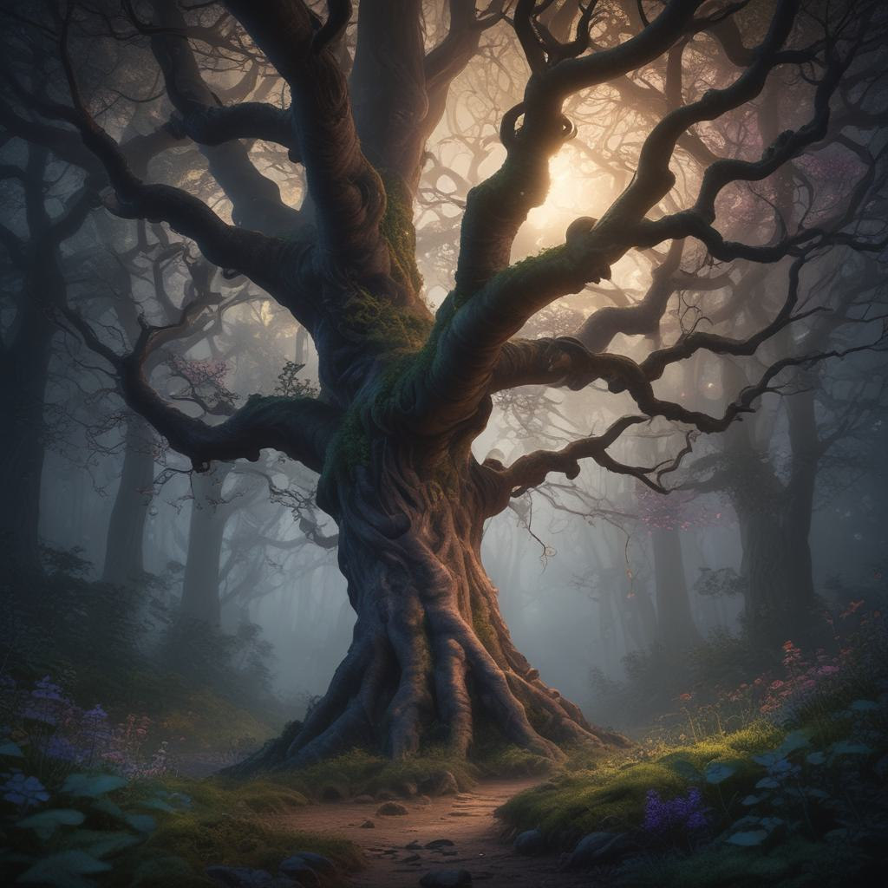

# Basic RPG

**Basic RPG** é um jogo de RPG simples e clássico que serve como uma base para entender e desenvolver os principais elementos de um RPG. Este projeto é ideal para iniciantes que desejam explorar o desenvolvimento de jogos e aprender sobre conceitos como criação de personagens, sistema de combate, exploração e muito mais.

## 🎮 Recursos do Jogo

- **Criação de Personagem**: Personalize seu personagem com diferentes classes, como Guerreiro, Mago e Arqueiro, cada um com suas habilidades únicas.
- **Sistema de Combate**: Combates baseados em turnos, onde você pode utilizar ataques, habilidades especiais e itens para derrotar inimigos.
- **Exploração de Mundo**: Explore um mapa básico com áreas diversas, encontrando NPCs e descobrindo segredos.
- **Missões e História**: Complete missões e siga uma narrativa simples que guia o jogador através do jogo.
- **Inventário e Itens**: Colete, gerencie e utilize itens como poções, armas e armaduras para fortalecer seu personagem.

## 🛠️ Como Jogar

- **Iniciar**: Ao iniciar o jogo, você será solicitado a criar seu personagem.
- **Explorar**: Use comandos específicos para navegar pelo jogo.
- **Combater**: Enfrente inimigos usando o sistema de combate baseado em turnos.
- **Missões**: Complete missões para progredir na história e ganhar recompensas.

## 🧑‍💻 Contribuindo

Contribuições são bem-vindas! Siga os passos abaixo para contribuir:

1. **Fork este repositório**
2. **Crie uma branch com a sua feature** (`git checkout -b feature/nova-feature`)
3. **Commit suas mudanças** (`git commit -m 'Adiciona nova feature'`)
4. **Push para a branch** (`git push origin feature/nova-feature`)
5. **Abra um Pull Request**

## 📄 Licença

Este projeto está licenciado sob a licença MIT. Veja o arquivo [LICENSE](LICENSE) para mais detalhes.

## 🤝 Agradecimentos

Agradecemos a todos que contribuíram para este projeto, seja com código, feedback ou inspiração.

---
